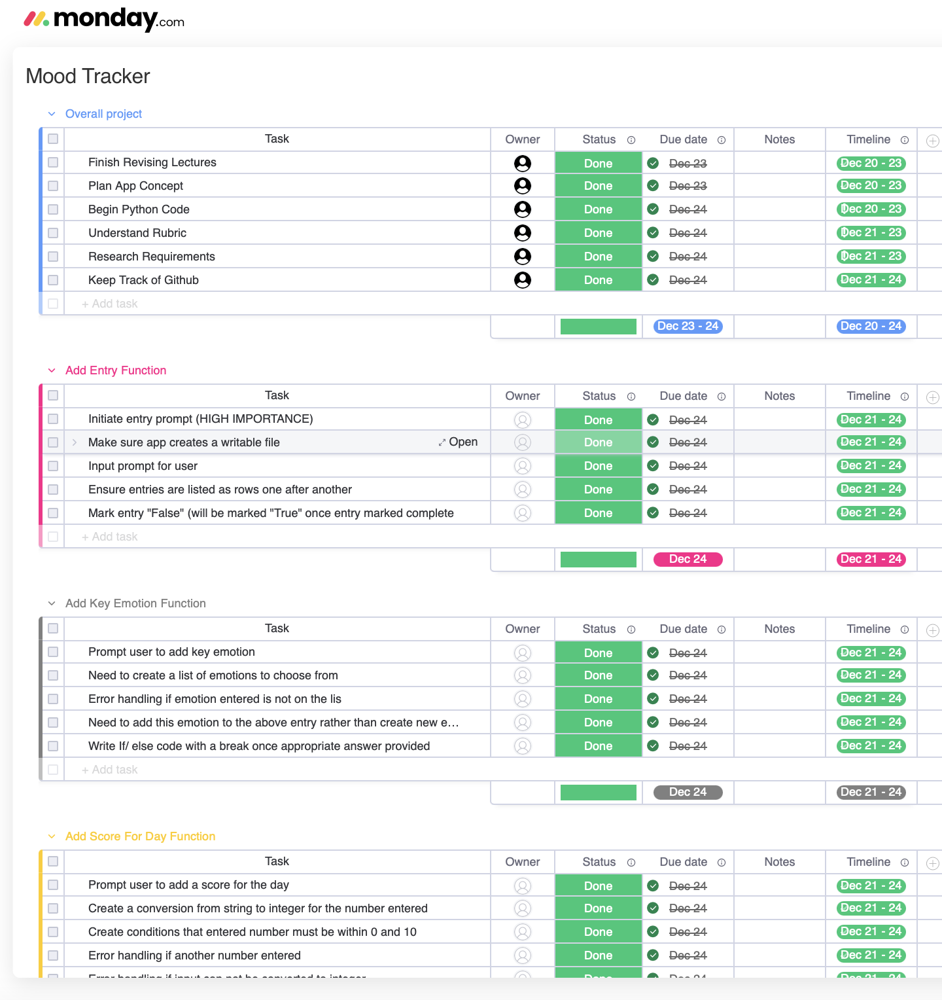

# Emma Downie Python App - Mood Tracker

### Link to github
This is a [link to my github](https://github.com/Emma-Downie/Mood_Tracker)

### Link to walkthrough
This is a [link to my slide walkthrough PART ONE](https://www.loom.com/share/718a5573363648a6bda1940e92de1165)
This is a [link to my code walkthrough PART TWO](https://www.loom.com/share/95a9b90b0cd240a89608079419211939)

## Identift Code Style Guide
The Style guide used in this project is PEP 8 style guide

## List of Features
The features of this application will be as follows
- A welcome to the mood tracker message will appear followed by a prompt to type out a new entry. This feature will open a new csv file if one does not exist and add an entry into the file. The entry will be marked as false until the feature 'mark entry complete' is used.
- The next feature will be to choose from a list of key emotions to describe the day. The app will only allow an entry of the approved words from the list to be entered. If the word if not from the list the app will use if/ else to ask the user to try again.
- The next feature is to ask the user to rate the day out of 10. This feautre will only allow the user to enter a number between and inclusive of 0 and 10 using try/ except. If the user does not enter an appropriate number they will be propted to try again.
- I'm thinking of adding a feature to combine the above 3 functions into a rolling prompt automatically upon open before displaying the list of other options.
- Once the first entry is entered, the app will show a list of the following functions:
- Add new entry will take user back to the top of the entries function.
- The next feature is to view all entires, which will use csv to read and print all entries.
- Mark entry complete will ask the user to type in an entry name that they would like to mark complete. csv writer will be used to rewite entries with true rather than false.
- The app will also have an option to exit which will terminate the program.

### Link to Monday.com project management
This is a [link to my Monday.com project management plan](https://view.monday.com/1833996549-9c30942194f129b3cbfd75bade20baf3?r=apse2)
And a screenshot:

## Help Documentation
To run this program, please follow these steps:
- Ensure that python is installed on your device.
- Follow the github link above to open the code.
- enter command: ./run.sh
- Python will then install all required packages
- The application will then open the you will be welcomed and prompted for input.
- After the inital 3 steps of entry are complete, you will be able to choose to enter another entry, mark an entry complete, view all entries, or exit the program.
- If you select the exit option, you will be thanked for using the mood tracker and the application will exit.
- To reopen the application, either re-enter .run/sh OR enter python3 main.py

